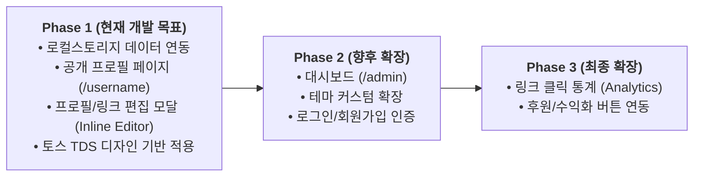
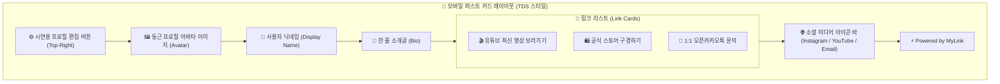

# 📄 [PRD] 링크트리 클론 서비스 "마이링크 (MyLink)"

> [!NOTE]
> **개발 전략 (단계별 시연 로드맵)**
> 현재 시연 단계에서는 **1단계: 로컬스토리지 기반 프로필 랜딩 페이지 및 기본 편집 기능**에 집중하여 신속히 개발을 진행합니다.
> 복잡한 통계/분석 대시보드 및 확장 기능은 2단계 이후 개발 대상으로 분류합니다.

---

## 1. 개발 로드맵 (Phased Roadmap)



---

## 2. 사용자 시나리오 (User Scenarios)

### 👤 시나리오 A: 방문자 (End-User) 관점
1. **페이지 방문**: 크리에이터의 인스타그램 프로필 바이오 링크(예: `mylink.com/creator_kim`)를 클릭하여 마이링크 프로필 랜딩페이지에 접속한다.
2. **프로필 확인**: 깔끔한 토스 TDS 디자인의 카드 레이아웃에서 크리에이터의 프로필 사진, 이름, 한 줄 소개를 한눈에 확인한다.
3. **링크 탐색 및 이동**: 원하는 링크 카드(예: "🎬 유튜브 최신 영상 보러가기") 또는 하단 소셜 아이콘(인스타그램, 이메일 등)을 클릭하여 해당 외부에 있는 타겟 웹페이지로 이동한다.

### ✏️ 시나리오 B: 프로필 소유자 / 시연자 (Owner / Presenter) 관점
1. **시연 모드 진입**: 프로필 랜딩페이지 우측 상단/하단의 '프로필 편집' 버튼(또는 모달 토글)을 클릭한다.
2. **프로필 수정**: 닉네임, 한 줄 소개, 프로필 아바타 이미지 URL을 변경하고 저장 버튼을 누른다.
3. **링크 관리**:
   - **새 링크 추가**: 제목과 URL을 입력하여 새 링크 카드를 생성한다.
   - **링크 수정/삭제**: 기존 링크의 제목을 변경하거나 불필요한 링크를 삭제/비활성화한다.
4. **실시간 반영 확인**: 저장과 동시에 브라우저 `localStorage`에 즉시 데이터가 업데이트되고, 프로필 화면이 새로고침 없이 즉시 새로워진 내용을 보여주는 것을 시연한다.

---

## 3. 와이어프레임 (Wireframes)

### 3.1. 메인 공개 프로필 화면 (`/creator_kim`) - 방문자 관점

```
+-------------------------------------------------------------+
|                                                             |
|                   [ ⚙️ 편집 (시연용 토글) ]                   |  <- 우측 상단 편집 버튼
|                                                             |
|                          ( O )                              |  <- 80x80 둥근 아바타 이미지
|                      김크리에이터                            |  <- display_name (grey-900, Bold)
|        안녕하세요! 마이링크에 오신 것을 환영합니다 🚀           |  <- bio (grey-700)
|                                                             |
|  +-------------------------------------------------------+  |
|  |  🎬  유튜브 최신 영상 보러가기                      🔗 |  |  <- 링크 카드 1 (TDS rounded-2xl)
|  +-------------------------------------------------------+  |
|                                                             |
|  +-------------------------------------------------------+  |
|  |  🛍️  공식 스토어 구경하기                          🔗 |  |  <- 링크 카드 2
|  +-------------------------------------------------------+  |
|                                                             |
|  +-------------------------------------------------------+  |
|  |  💬  1:1 오픈카카오톡 문의                          🔗 |  |  <- 링크 카드 3
|  +-------------------------------------------------------+  |
|                                                             |
|                 [ 📸 ]   [ 🎥 ]   [ ✉️ ]                    |  <- 소셜 아이콘 바 (인스타/유튜브/이메일)
|                                                             |
|                      Powered by MyLink                      |  <- 푸터 브랜드 표기
|                                                             |
+-------------------------------------------------------------+
```



---

## 4. Phase 1 핵심 기능 명세 (Current Scope)

### 2.1. 로컬스토리지 기반 프로필 데이터 지속화
- 서버/DB 없이 브라우저 `localStorage`를 데이터 원천(Single Source of Truth)으로 활용.
- 페이지 진입 시 `localStorage`의 데이터를 읽어와 프로필 및 링크 카드 렌더링.
- 최초 방문 시 시연용 **기본 샘플 데이터(Mock Data)** 자동 로드.

### 2.2. 공개 프로필 랜딩 페이지 (`/username`)
- **모바일 퍼스트 카드 레이아웃** (토스 TDS 기반 디자인 적용)
- **프로필 세션**: 프로필 아바타 이미지, 사용자 이름(`display_name`), 한 줄 소개글(`bio`)
- **링크 카드 리스트**:
  - 활성화된 링크 버튼 표출 (제목 + 클릭 시 해당 URL로 이동)
  - Hover/Active 애니메이션 및 토스 라운드 스타일 적용
- **소셜 아이콘 바**: 하단 SNS 연결 버튼 (인스타그램, 유튜브, X, 이메일 등)

### 2.3. 간이 프로필/링크 편집기 (Profile & Link Editor)
- 시연 및 테스트를 위해 프로필 페이지 내에서 직접 프로필 및 링크 항목을 수정/추가/삭제할 수 있는 **편집 모달/토글 기능** 제공
- 편집 내용 수정 즉시 `localStorage` 저장 및 프로필 화면에 실시간 반영

---

## 3. 디자인 시스템 가이드라인 (Toss TDS)

- **Primary Color**: Toss Blue (`#3182F6` / `blue-500`) - 주요 버튼 및 강조 텍스트
- **Background**: 라이트 모드 (`#F9FAFB` / `grey-50`), 카드 컨테이너 (`#FFFFFF` / `#F2F4F6`)
- **Typography & Text Color**: Primary Text (`#191F28` / `grey-900`, 순수 검정 금지), Secondary (`#4E5968` / `grey-700`)
- **Border Radius & Style**: 부드러운 둥근 모서리 (`rounded-2xl` ~ `rounded-full`), 미니멀 그림자 효과

---

## 4. 기술 스택 및 상태 관리 (Tech Stack)

| 영역 | 기술 스택 | 비고 |
| :--- | :--- | :--- |
| **Frontend** | React / Next.js, Tailwind CSS | 반응형 Web UI 및 모바일 퍼스트 레이아웃 |
| **Design System** | TDS (Toss Design System) | 토스 블루, `grey-900`, 둥근 알약/라운드 버튼 |
| **State & Storage** | Zustand + LocalStorage | `localStorage` 데이터를 Zustand 스토어와 연결하여 실시간 UI 동기화 |
| **Deployment** | Vercel / GitHub Pages | 클라이언트 사이드 단독 배포 |

---

## 5. Phase 1 LocalStorage 데이터 구조

```json
{
  "mylink_profile": {
    "username": "creator_kim",
    "display_name": "김크리에이터",
    "bio": "안녕하세요! 마이링크에 오신 것을 환영합니다 🚀",
    "avatar_url": "https://images.unsplash.com/photo-1534528741775-53994a69daeb?w=400",
    "socials": {
      "instagram": "https://instagram.com",
      "youtube": "https://youtube.com",
      "email": "mailto:creator@example.com"
    }
  },
  "mylink_links": [
    {
      "id": "link_1",
      "title": "🎬 유튜브 최신 영상 보러가기",
      "url": "https://youtube.com",
      "is_active": true,
      "display_order": 1
    },
    {
      "id": "link_2",
      "title": "🛍️ 공식 스토어 구경하기",
      "url": "https://smartstore.naver.com",
      "is_active": true,
      "display_order": 2
    },
    {
      "id": "link_3",
      "title": "💬 1:1 오픈카카오톡 문의",
      "url": "https://open.kakao.com",
      "is_active": true,
      "display_order": 3
    }
  ]
}
```

---

## 6. 2단계 및 3단계 대상 기능 (Post-Phase 1 Backlog)

- **Phase 2**: 대시보드 관리자 페이지 (`/admin`), 다중 테마 선택기, 회원가입/로그인 세션 관리
- **Phase 3**: 링크 클릭 및 페이지 방문 수 통계 (Analytics & Chart), 카카오페이/토스 후원 버튼 연동
